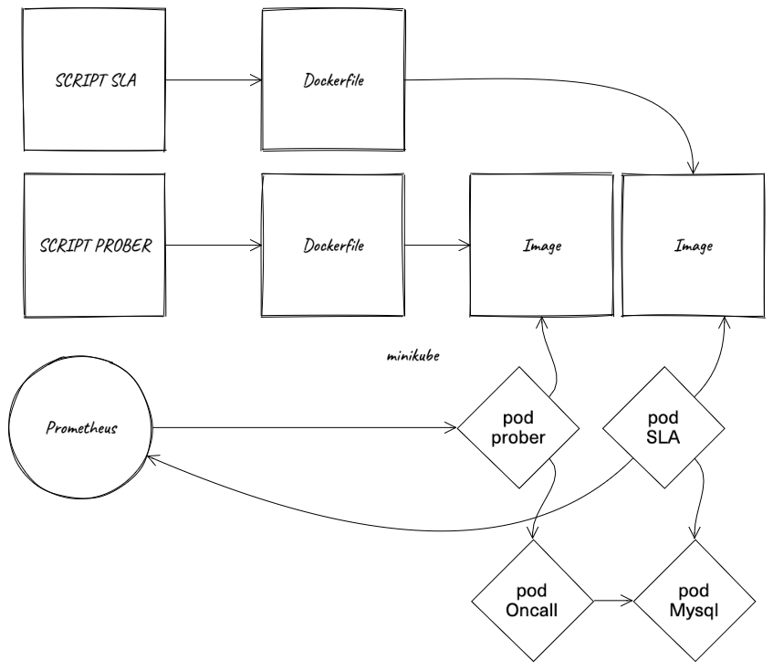

# Домашнее задание №7 "Метрики. SLA."

TODO FIX lab 5

## 1 задание

Написать пробер на Oncall и настроить сбор метрик в Prometheus с пробера

1) Написать свой пробер Oncall
2) Создать Docker образ с пробером
3) Запустить контейнер из образа с пробером в minikube
4) Настроить сбор метрик с пробера в Prometheus

## Схема



> [!NOTE]
> **Критерии оценки**:
> * 4 баллов - прикрепить свой пробер
> * 2 балла - прикрепить Dockerfile
> * 2 балла - скриншот/видеозапись развернутого пробера в minikube
> * 2 балла - скриншот/видеозапись выполнить запрос метрик в Prometheus, которые отдает пробер

## 2 задание
Написать программу подсчета SLA Oncall

1) Написать программу для подсчета SLA Oncall
2) Создать Docker образ с пробером
3) Запустить контейнер из образа с пробером в minikube
4) Настроить сбор метрик с пробера в Prometheus

> [!NOTE]
> **Критерии оценки**:
> * 4 баллов - прикрепить свою программу подсчета SLA Oncall
> * 2 балла - прикрепить Dockerfile
> * 2 балла - скриншот/видеозапись развернутой программы подсчета SLA в minikube
> * 2 балла - скриншот/видеозапись выполнить запрос метрик в Prometheus, которые отдает программу подсчета SLA

```
---
config:
  look: handDrawn
  theme: neutral
---
architecture-beta
    %% solar:crown-minimalistic-bold
    service sla_app(akar-icons:crown)[sla]
    service prober_app(akar-icons:crown)[prober]

    service sla_app_dockerfile(nonicons:docker-16)[Dockerfile]
    service prober_app_dockerfile(nonicons:docker-16)[Dockerfile]


    group api(nonicons:kubernetes-16)[minikube]

    service sla_app_pod(pajamas:pod)
    service prober_app_pod(pajamas:pod)
    service prometheus(simple-icons:prometheus)
```


prometheus
-->
pod SLA самописный
-->
pod Проббер самописный
-->
pod OnCall


## Dependencies
[nim-metrics](https://github.com/status-im/nim-metrics) — Nim metrics client library supporting the Prometheus monitoring toolkit, StatsD and Carbon


https://artifacthub.io/packages/helm/traefik/traefik/32.1.1?modal=values
