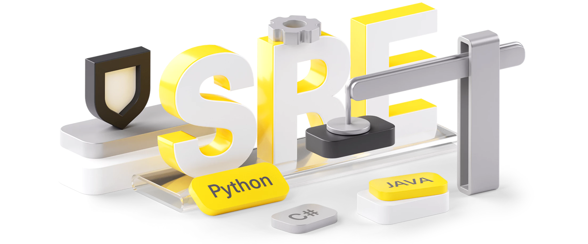

# SRE-basic

Курс SRE от Тбанка в рамках 3-4 семестра Академии Бэкенда

## Темы

1) Основы Kubernetes
2) CRD. Ingress
3) Развёртывание Oncall
4) Логирование. Elasticsearch + Kibana
5) Метрики. Prometheus
6) Метрики. Kubernetes
7) Метрики. SLA
8) Grafana
9) AlertManager
10) Стратегии деплоя
11) Балансировка
12) Практики надежности